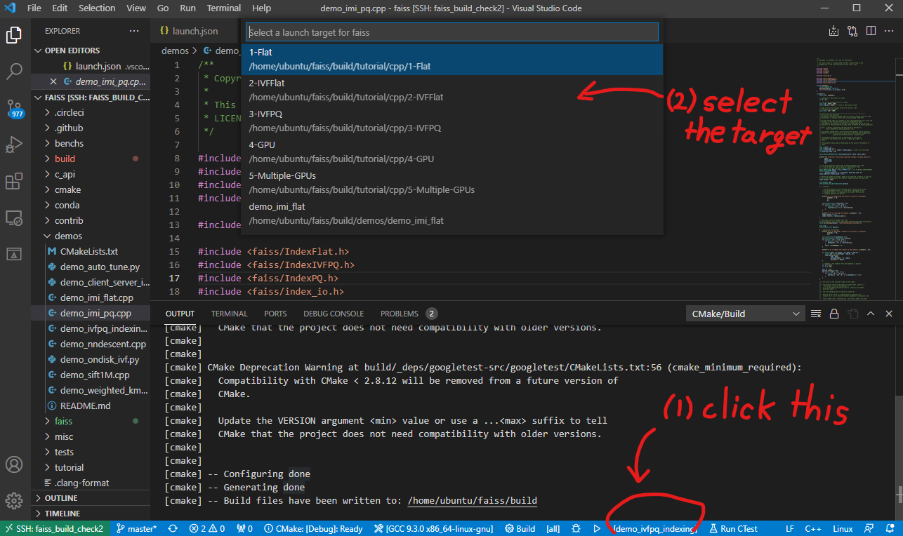
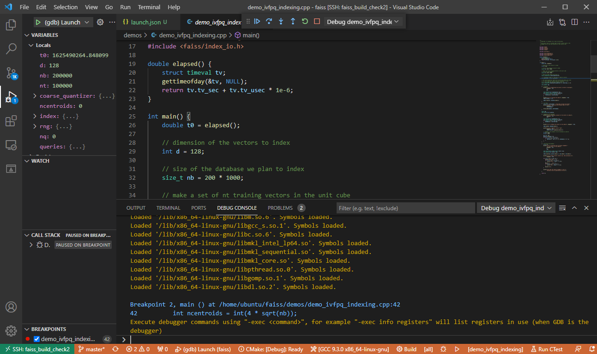

# Develop
- We assume that you've [already installed faiss](build.md)

## How to add your class
Let's write your index, build the library with it, and use it in python. Here, we will add `IndexHello` class, which is inherited from `IndexFlatL2` class but with `hello` function.

Add the following file as `IndexHello.h` at `$HOME/faiss/faiss`.
```c++
#ifndef FAISS_INDEX_Hello_H
#define FAISS_INDEX_Hello_H

#include <faiss/IndexFlat.h>

namespace faiss {

struct IndexHello : IndexFlatL2 {
    explicit IndexHello(int d) : IndexFlatL2(d) {}
    IndexHello() {}
    void hello();
};

} // namespace faiss

#endif

```

and the following as `IndexHello.cpp`.

```c++
#include <faiss/IndexHello.h>

namespace faiss {

void IndexHello::hello() {
    printf("Hello!\n");
}

} // namespace faiss
```

Then, please edit `$HOME/faiss/faiss/CMakeLists.txt`.
You should add two lines:
- `IndexHello.cpp` at the `set(FAISS_SRC ...` block.
- `IndexHello.h` at the `set(FAISS_HEADERS ...` block.

That's all. You can build the faiss again.
```bash
make -C build -j faiss_avx2
```
Note that we build `faiss_avx2` only since that's all we use.

## Run your class in c++
The easiest way to make sure `IndexHello` works is to add a script in the `demos` directory.

Save the following file as `demo_hello.cpp` at `$HOME/demos`.
```c++
#include <faiss/IndexHello.h>

int main() {
    faiss::IndexHello index(100);
    index.hello();
    return 0;
}
```
Then append the following lines at `$HOME/demos/CMakeLists.txt`.
```bash
add_executable(demo_hello EXCLUDE_FROM_ALL demo_hello.cpp)
target_link_libraries(demo_hello PRIVATE faiss_avx2)
```

Then build and run it.
```bash
make -C build -j demo_hello
./build/demos/demo_hello
```
You can obtain the result:
```console
Hello!
```

## Run your class in python
To use your class inside python, you need to update the following lines on `$HOME/faiss/python/swigfaiss.swig`. Because we inherit `IndexPQ` this time, it would be good to write the line after the counterpart of `IndexPQ`.
- Add `#include <faiss/IndexHello.h>` after `#include <faiss/IndexPQ.h>`
- Add `%include  <faiss/IndexHello.h>` after `%include  <faiss/IndexPQ.h>`
- Add `DOWNCAST ( IndexHello )` after `DOWNCAST ( IndexPQ )`. Note that this addition depends on the inheritance of your class.

Let's build it.
```bash
make -C build -j swigfaiss_avx2
cd build/faiss/python
python setup.py install
```
Note that:
- If you build `swigfass_avx2`, it automatically build `faiss_avx2` as well. So you don't need to explicitly run `make -C build -j faiss_avx2`
- `swigfaiss.swig` is automatically copied to `swigfaiss_avx2.swig`. 

After that, you can use your class in python. 
Save the following script as `check.py`.
```python
import faiss
import numpy as np

D = 128
N = 1000
X = np.random.random((N, D)).astype(np.float32)

index = faiss.IndexHello(D)
index.add(X)
dist, ids = index.search(x=X[:3], k=5)
print(dist)
print(ids)

index.hello()
```

Run it by `python check.py`, then you'll obtain the result.
```console
[[ 0.        16.569878  16.886839  17.121437  17.430017 ]
 [ 0.        15.254007  15.329275  15.539896  15.809263 ]
 [ 0.        15.9044075 15.939333  16.18483   16.36927  ]]
[[  0 197 443 254 571]
 [  1 742 293 532 204]
 [  2 350 554 788 742]]
Hello!
```


## Debug

Here, I will introduce how to debug the c++ files. Mainly,
I focus the files in the `demos` directory.
It is because they are already under the cmake managament, thus easy to debug.

In summary, we will follow the official tutorial of [CMake Tools on Linux for vscode](https://code.visualstudio.com/docs/cpp/cmake-linux)


First, install gdb:
```bash
sudo apt install gdb
```

Open the faiss directory (`$HOME/faiss`) by vscode. Install [C/C++ extension](https://marketplace.visualstudio.com/items?itemName=ms-vscode.cpptools) and [CMake Tools](https://marketplace.visualstudio.com/items?itemName=ms-vscode.cmake-tools).

You first need to specify your compiler. Open the Command Palette (`Ctrl+Shift+P`), and run the **CMake: Select a Kit**. Select the g++ that you used to build faiss.

You then need to select the variant (Debug or Release). Open the Command Palette again and run the **CMake: Select Variant**. Select **Debug**.

Then, run the cmake again in the terminal of vscode.
```bash
cmake -B build \
    -DBUILD_SHARED_LIBS=ON \
    -DBUILD_TESTING=ON \
    -DFAISS_OPT_LEVEL=avx2 \
    -DFAISS_ENABLE_GPU=OFF \
    -DFAISS_ENABLE_PYTHON=$HOME/miniconda/bin/python \
    -DCMAKE_BUILD_TYPE=Release .
```
(I'm not sure why we need this process, but it seems that we need to manually specify `build/CMakeCache.txt`)


Open the Command Palette and run the **CMake: Configure**.

Open the Command Palette and run the **CMake: Build**. 

Now you can select the build target. Click the area at the bottom of the window. Then select the target you want to debug. 


Now you can run the debugger. There are three ways to debug, so do the one you like.
- Open the Command Palette and run the **CMake: Debug**.
- Press `CTRL+F5` (**Not** `F5`. See [this](https://vector-of-bool.github.io/docs/vscode-cmake-tools/debugging.html#quick-debugging). What we do here is so-called `Quick Debugging`)
- Click the bug button at the bottom of the window 

